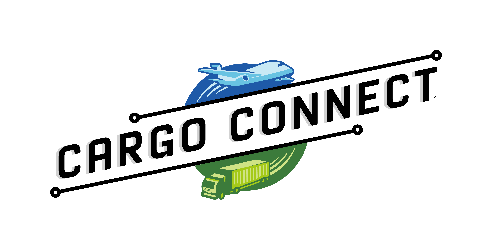

# Cargo Connect Dregos Spike Prime Code

This was a building year for Team Dregos. We spent a lot of time learning how to code, and how the LEGO (r) competition works.
Youtube was one of our best sources for learning how to code and how the Spike Prime worked.
Most of our code was to learn how to make better Code Blocks for driving accurately.

## Drive By Gyro
There are code blocks in Spike Prime for driving straight but they don't take into consideration that the robot might turn off course whiole moving.
By using the gyro inside the Spike prime we can make sure the robot always travels in the direction we want it to go.
The example on Youtube was a Drive by Gyro for a specified time. We needed to modify this code to get it to drive by gyro for a specific distance.

One of the things we learned is CIRCUMFERENCE which is the distance around the wheels we attach to our robot. We used a fabric tape measure to measure teh circumference of the wheels. 

<table>
<tr><td><b>Small Wheels</b></td><td>17.5cm</td></tr>
<tr><td><b>Large Wheels</b></td><td>27.6cm</td></tr>
</table>

We were told that every time the wheel turns 360 Degrees the robot travels the circuference of the wheel.

`360 Degrees = 27.6cm`

Using this info we created [Drive by Gyro](./FLL%20Driving%20and%20Turning.llsp)

## Turn By Gyro
Spike Prime comes with a turn block but we didn't understand it at first. 

Instead we decided to create our own turn code using the gyro and decided that our robot should turn in place instead of driving around corners.
This code was easy at first because you tell one wheel to turn forward and the other to turn backward until the Gyro says you have turned enough.
We then realized we had to update it to include left and right turns. 
We also learned that the Gyro does not record 360 degrees so we decided to break our turns up into 90 degree segments.
This is what is in [Turn by Gyro](./FLL%20Driving%20and%20Turning.llsp)
